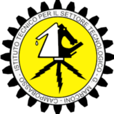

  <h4>
    
     
    <strong text-align: center;>Istituto Tecnico G. Marconi L. Pilla - Olimpiadi di Informatica</ strong>
     
    <strong>
    Benvenuti nell'organizzazione GitHub dell' <a href="https://iti-marconi.edu.it/">Istituto Tecnico G. Marconi L. Pilla</a> dedicata alle <a href="https://www.olimpiadi-informatica.it">Olimpiadi di Informatica</a>. 
    Questo spazio è riservato agli studenti partecipanti, dove troverete materiale per la         preparazione alle competizioni.
    </strong>
  </h4>

    

    <h3><b>—͟͞͞📂】Repositories</b></h3>
    

    <ul style="list-style-position: inside;">
      

          <h3><b>📚 Esercizi e Problemi</b></h3>
          
📘 Raccolta di esercizi e problemi di allenamento per le Olimpiadi di Informatica

          <h3><b>📝 Soluzioni</b></h3>
          
✅ Soluzioni ufficiali e proposte dai partecipanti.

      

    </ul>
    

    <h3><b>—͟͞͞💻】Come Partecipare</b></h3>
    

    <ul style="list-style-position: inside;">
      

          
<b>🔧 Gli studenti possono contribuire seguendo questi semplici passi:</b>

          
🗄️ Forka la repository.

          
🛣️ Crea un branch per le modifiche.

          
📤 Invia una pull request con una descrizione delle modifiche.

      

    </ul>
    

    <h3><b>—͟͞͞📧】Contatti</b></h3>
    

    <ul style="list-style-position: inside;">
      

          
<b>📞 Per ulteriori informazioni, contattare il proprio docente referente.

      

    </ul>

