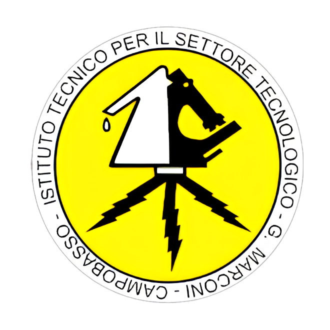

  
   
  <strong text-align: center;>Istituto Tecnico G. Marconi L. Pilla - Olimpiadi di Informatica</strong>

  <strong>Benvenuti nell'organizzazione GitHub dell' <a href="https://iti-marconi.edu.it/">Istituto Tecnico G. Marconi L. Pilla</a>
  dedicata alle <a href="https://www.olimpiadi-informatica.it/">Olimpiadi di Informatica</a>. Questo spazio è riservato agli studenti partecipanti, dove troverete materiale per la preparazione alle competizioni.</strong>

## 📁 Repositories

### 1. **Esercizi e Problemi**
   - Raccolta di esercizi e problemi di allenamento per le Olimpiadi di Informatica.

### 2. **Soluzioni**
   - Soluzioni ufficiali e proposte dai partecipanti.

## 💻 Come Partecipare

Gli studenti possono contribuire seguendo questi semplici passi:

1. **Forka** la repository.
2. Crea un **branch** per le modifiche.
3. **Invia una pull request** con una descrizione delle modifiche.

## 📧 Contatti

Per ulteriori informazioni, contattare il proprio docente referente.
